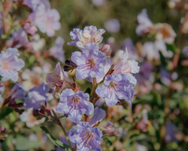

# okbayer

A small Bayer dithering library. Applies Bayer 8x8 ordered dithering to an image in Oklab color space using a provided palette.

## Usage

```rust
let dithered = okbayer::dither_bayer_oklab(
    &image_bytes,
    &palette_bytes,
    width,
    height,
    0.5, // dither_strength (0.0 = none, 1.0 = full)
)?;
```

## Example Output

Original (Taken by me) | Dithered, 1.0 strength ([island-joy-16 palette](https://lospec.com/palette-list/island-joy-16))
--- | ---
 | 

## Input/Output Format

- Image: `&[u8]` - RGB8 pixels, flat array. Length must be `width*height*3`
- Palette: `&[u8]` - RGB8 colors, flat array. Length must be divisible by 3, cannot be empty
- Output: `Vec<u8>` - RGB8 dithered pixels, same length as input

## Error Handling

Returns `Result<Vec<u8>, DitherError>`:

- `InvalidImageBufferSize` - image length not divisible by 3
- `InvalidPaletteBufferSize` - palette length not divisible by 3
- `EmptyPalette` - palette is empty
- `DimensionMismatch { expected, actual }` - image length doesn't match `width*height*3`

## License

MIT